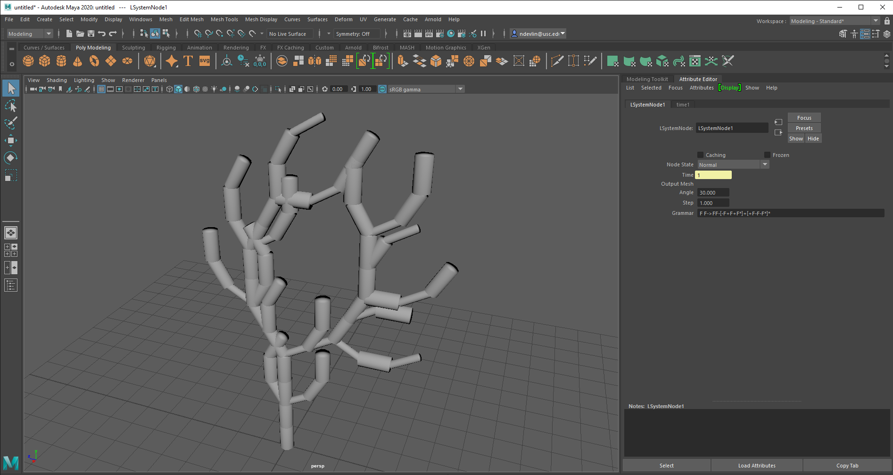

# LSystem Maya Plug In

## Nathan Devlin - @ndevlin - ndevlin@seas.upenn.edu - www.ndevlin.com

 

## A CPP based LSystem Plugin for Autodesk Maya

An L-System creator plug-in for Maya. The user can input an L-System geometry, a default angle, number of iterations, and other parameters to create organic structures like trees, coral, etc. The plugin is created in C++ and is imported as an mll file. I also implemented this project as a SWIG-wrapped Python plugin that builds on this code and adds a nicer MEL-based interface to allow the user to modify parameters more intuitively. The tools used were Maya 2020, Visual Studio, SWIG, and PyCharm.

The .mll file to plug into Maya can be found at LSystemMayaPlugin/x64/Debug/LSystemMaya.mll

